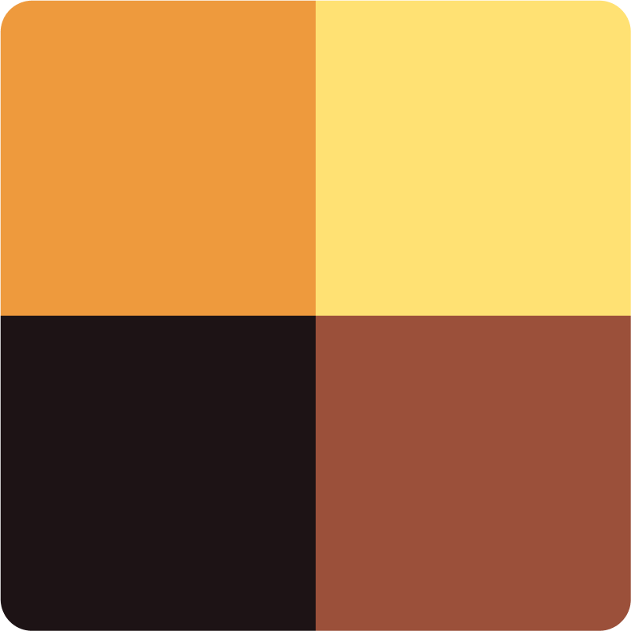

# Ціль

Сучасна компільована українська мова програмування.

## Приклад

ext.cpp:

```shell
#include <iostream>

extern "C" void друк(char* str) {
  std::cout << str << std::endl;
}
```

привіт.ц:

```ціль
екстерн дія друк(ц8* стр);

дія старт() {
  друк("привіт!");
}
```

```shell
ціль сплавити привіт.ц
clang++ -o привіт привіт.o ext.cpp
./привіт
```